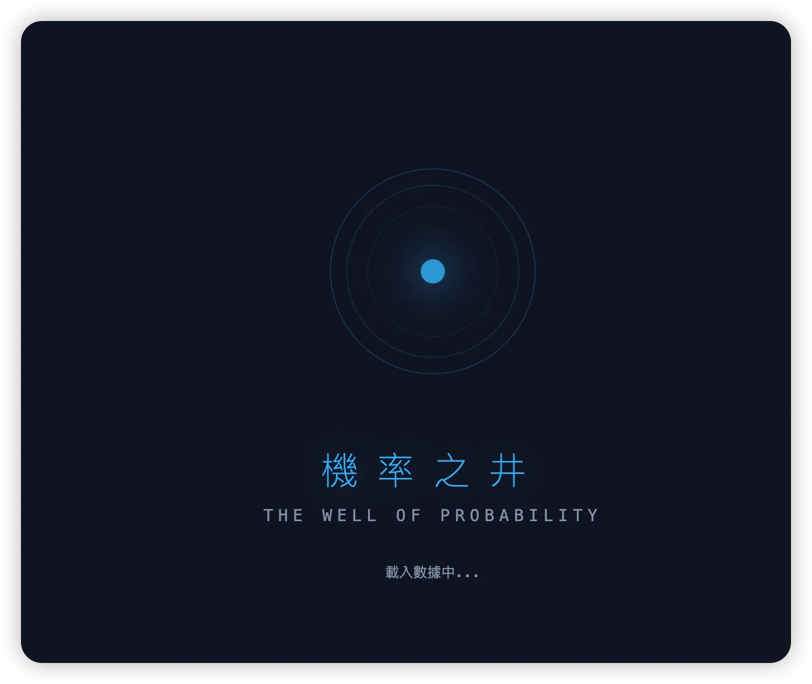
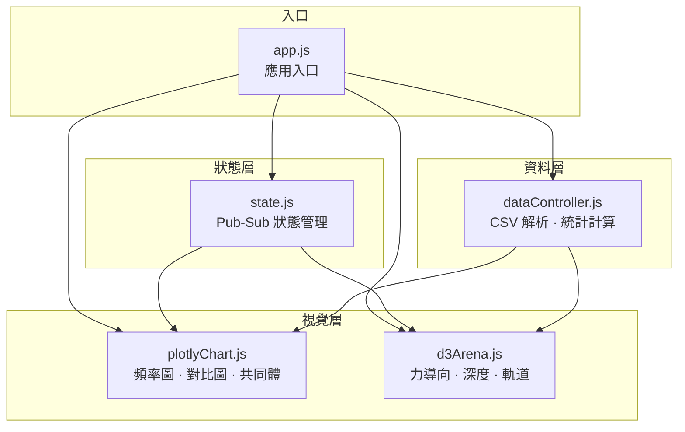
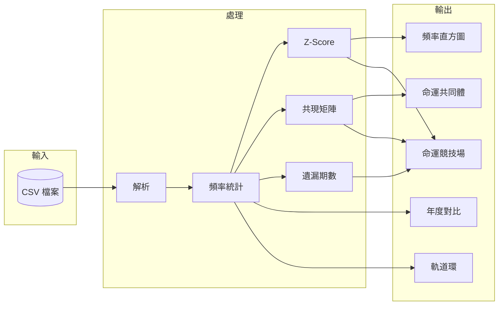
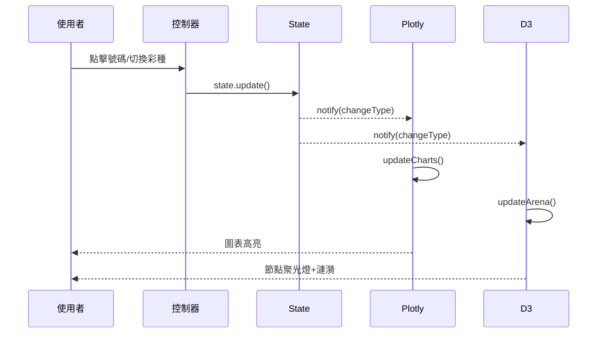

# 機率之井 The Well of Probability

[](https://opensource.org/licenses/MIT)
[](https://plotly.com/javascript/)
[](https://d3js.org/)

[← 回到 Muripo HQ](https://tznthou.github.io/muripo-hq/) | [English](README_EN.md)

一個結合 Plotly.js 與 D3.js 的台灣樂透數據視覺化工具，以「數據考古實驗室」美學呈現歷史開獎統計。



> **"機率是歷史的總結，不是未來的預言。"**

---

## 核心概念

樂透號碼的歷史統計只能告訴我們「過去發生了什麼」，而非「未來會發生什麼」。每一次開獎都是獨立事件，機率不會因為某個號碼「該出現了」就增加。

我們選擇以「井」為意象——你可以往井裡看，看見過去的倒影；但井水不會告訴你明天的天氣。

這個工具讓你**觀察**歷史數據的分佈，而非**預測**未來的結果。

---

## 功能特色

| 功能 | 說明 |
|------|------|
| **雙引擎視覺化** | Plotly.js 統計面板 + D3.js 力導向命運競技場 |
| **深度下沉效果** | 越常作為特別號的號碼，在競技場中沉得越深 |
| **命運共同體** | 統計最常一起出現的號碼對，點擊可見連線 |
| **年度對比圖** | 比較 2024 與 2025 年度的出現頻率趨勢 |
| **雙彩種支援** | 大樂透 (49選6) 與 威力彩 (38選6+第二區) |

---

## 視覺設計

### 色彩計畫

採用「數據考古實驗室」美學——低光度、高沈浸感的冷靜色調：

| 狀態 | 色彩 | 說明 |
|------|------|------|
| **普通** | 科技藍 `#38bdf8` | 正常範圍內的號碼 |
| **天選之子** | 琥珀金 `#fbbf24` | Z-Score > 2 的高頻號碼 |
| **被遺忘者** | 冰藍 `#67e8f9` | Z-Score < -2 的低頻號碼 |

### 深度下沉機制

在「命運競技場」中，號碼的 Y 軸位置代表其作為特別號的頻率：

- **頂部**：從未或很少作為特別號
- **底部**：經常作為特別號，彷彿被命運拉向井底

這與頻率直方圖的「高度」形成有趣的對比——在統計面板中高頻是好事，在競技場中「下沉」則暗示另一種命運。

---

## 技術架構

### 技術棧

| 技術 | 用途 | 備註 |
|------|------|------|
| [Plotly.js](https://plotly.com/javascript/) | 統計圖表 | 頻率直方圖、年度對比 |
| [D3.js v7](https://d3js.org/) | 力導向圖 | 命運競技場、軌道環 |
| Vanilla JS | 無框架前端 | 模組化設計 |
| ES Modules | 程式碼組織 | 原生 import/export |

### 狀態管理

使用簡單的發布-訂閱模式，讓 Plotly 與 D3 兩個引擎即時同步：

```javascript
state.subscribe((changeType, currentState) => {
    // 處理 lotteryType, year, selection, pairSelection 變更
});
```

### 架構圖

#### 模組依賴關係



#### 資料流程



#### 互動流程



### 模組結構

| 模組 | 職責 |
|------|------|
| `state.js` | 全域狀態管理、發布-訂閱 |
| `dataController.js` | CSV 解析、頻率統計、Z-Score、共現矩陣 |
| `plotlyChart.js` | 統計圖表渲染、命運共同體卡片 |
| `d3Arena.js` | 力導向圖、深度效果、軌道環、連線高亮 |
| `app.js` | 應用入口、控制器初始化、狀態變更處理 |

### 安全性措施

| 措施 | 說明 |
|------|------|
| **SRI 驗證** | CDN 資源 (Plotly, D3, Font Awesome) 使用 Subresource Integrity 雜湊驗證 |
| **CSV Injection 防護** | 過濾 `=`, `+`, `-`, `@` 等危險前綴，防止公式注入 |
| **輸入驗證** | CSV 解析時驗證欄位數量、資料格式、空值處理 |
| **狀態循環保護** | Pub-Sub 通知機制防止無限循環，使用 `_isNotifying` 旗標 |

### 無障礙性 (Accessibility)

| 功能 | 實作 |
|------|------|
| **ARIA 標籤** | 所有控制項、圖表區域均有適當的 `role`, `aria-label`, `aria-describedby` |
| **鍵盤導航** | 切換按鈕支援方向鍵切換，命運共同體卡片支援 Enter/Space 選取 |
| **螢幕閱讀器** | 使用 `.sr-only` 類別提供螢幕閱讀器專用描述文字 |
| **焦點管理** | 互動元素有明確的 `tabindex` 和焦點樣式 |

### 測試

使用 [Vitest](https://vitest.dev/) 進行單元測試：

```bash
# 執行測試
npm test

# 監聽模式
npm run test:watch

# 測試覆蓋率
npm run test:coverage
```

測試涵蓋範圍：
- `state.js` - 狀態管理、訂閱/通知、循環保護 (10 tests)
- `dataController.js` - 常量驗證、統計計算、共現矩陣 (21 tests)

### 常量組織

所有魔術數字均提取為具名常量，按類別組織以提高可維護性：

#### 業務常量 (`dataController.js`)

```javascript
LOTTERY_RANGES      // 彩券號碼範圍 { lotto: 49, super: 38+8 }
MAIN_NUMBERS_PER_DRAW  // 每期主號數量 (6)
Z_SCORE_THRESHOLD   // 天選之子/被遺忘者閾值 (±2)
```

#### 視覺常量 (`d3Arena.js`)

```javascript
FORCE_CONFIG   // 力導向模擬參數 (charge, collide, strength)
NODE_SIZE      // 節點尺寸 { min: 8, range: 22 }
DEPTH_CONFIG   // 深度配置 (水面線、Y軸範圍)
ORBIT_CONFIG   // 軌道區配置 (威力彩第二區)
ANIMATION      // 動畫時長 (spotlight, ripple, connection)
VISUAL         // 視覺效果 (strokeWidth, opacity, fontSize)
TIMING         // 時間配置 (debounce, rippleDelay)
```

#### 圖表常量 (`plotlyChart.js`)

```javascript
CHART_MARGIN     // 圖表邊距 { top, right, bottom, left }
X_AXIS_DTICK     // X 軸刻度間距 { lotto: 5, super: 4 }
TOP_PAIRS_COUNT  // 命運共同體顯示數量 (10)
LINE_WIDTH       // 線條寬度 { thin, normal, highlight }
```

---

## 專案結構

```
day-29-well-of-probability/
├── index.html              # 主頁面 (含 SRI、ARIA)
├── favicon.svg             # SVG Favicon (硬幣入井意象)
├── css/
│   └── style.css           # 樣式表 (含 .sr-only)
├── js/
│   ├── app.js              # 應用程式入口
│   ├── state.js            # 全域狀態管理 (循環保護)
│   ├── dataController.js   # 數據處理與統計 (CSV 防護)
│   ├── plotlyChart.js      # Plotly 圖表模組 (ARIA)
│   └── d3Arena.js          # D3 力導向圖模組
├── data/
│   ├── lotto_2024.csv      # 大樂透 2024 數據
│   ├── lotto_2025.csv      # 大樂透 2025 數據
│   ├── super_2024.csv      # 威力彩 2024 數據
│   └── super_2025.csv      # 威力彩 2025 數據
├── tests/
│   ├── state.test.js       # 狀態管理測試 (10 tests)
│   └── dataController.test.js  # 數據控制器測試 (21 tests)
├── package.json            # npm 設定 (Vitest)
├── vitest.config.js        # Vitest 配置
├── README.md
└── README_EN.md
```

---

## 本地開發

```bash
# 複製專案
git clone https://github.com/tznthou/day-29-well-of-probability.git
cd day-29-well-of-probability

# 安裝測試依賴 (可選)
npm install

# 執行測試
npm test

# 使用 Live Server 或任何靜態伺服器開啟
# VS Code: 安裝 Live Server 擴充功能，右鍵 index.html → Open with Live Server
```

---

## 數據來源

數據來自台灣彩券官方網站的歷史開獎紀錄：

- [大樂透](https://www.taiwanlottery.com.tw/Lotto/Lotto649/history.aspx)
- [威力彩](https://www.taiwanlottery.com.tw/Lotto/SuperLotto638/history.aspx)

---

## 隨想

### 一個奇怪的專案

這個專案很奇怪。它花了大量時間去分析一個本質上無法預測的事物。

但也許這正是重點。

人們總是想從隨機中找到規律，從混亂中看見秩序。這不是愚蠢，這是人類認知的本能。我們的大腦就是被設計來尋找模式的。

### 井的隱喻

我選擇「井」作為意象，是因為井有一種奇特的性質：

- 你可以往下看，看見水面的倒影
- 倒影是真實的——它確實反映了此刻的天空
- 但倒影無法告訴你明天會不會下雨

歷史數據就像井水中的倒影。它是真實的，但它只反映過去。

### 負責任的態度

這個工具刻意不提供任何「推薦號碼」或「預測功能」。

因為沒有任何統計方法能預測獨立隨機事件的下一次結果。如果有人告訴你他們可以，那他們不是在說謊，就是不懂機率。

我們能做的，是誠實地展示歷史數據，讓你自己做出判斷。

---

## 免責聲明

本工具僅供教育與娛樂目的。歷史統計數據**不能**預測未來開獎結果。每次開獎都是獨立事件，請理性購彩。

---

## 授權

本作品採用 [MIT License](https://opensource.org/licenses/MIT) 授權。

---

## 相關專案

- [Day-27 Fortune Echoes](https://github.com/tznthou/day-27-fortune-echoes) - 彩券頭獎地圖（地理維度的彩券視覺化）

---

> **"往井裡看，你會看見過去的倒影。但記住，井水不會告訴你明天的天氣。"**
