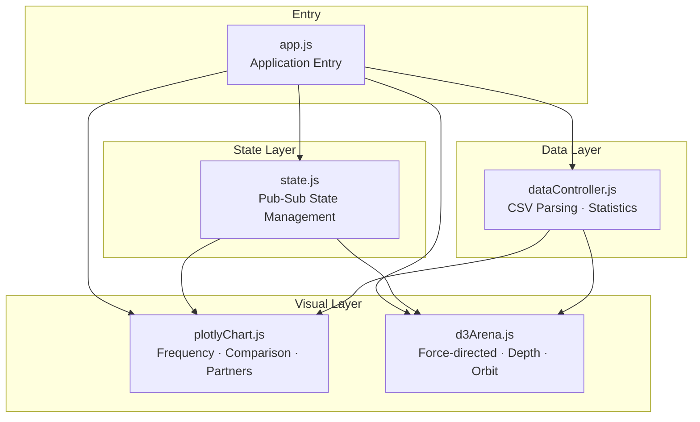
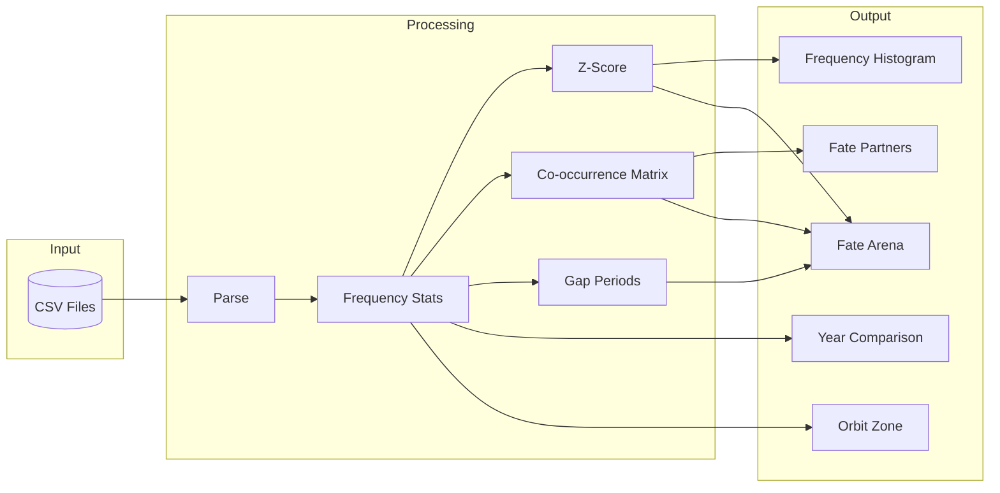
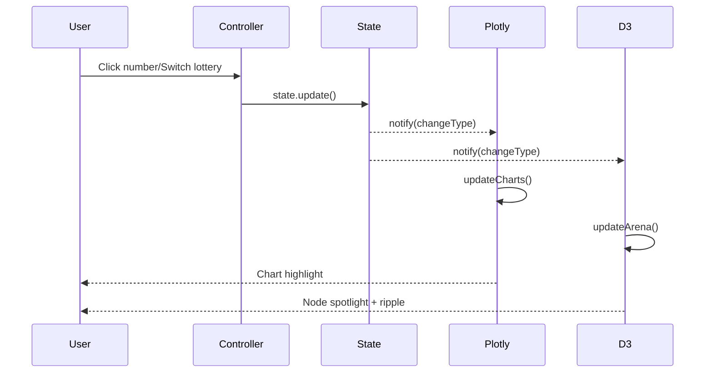

# The Well of Probability 機率之井

[](https://opensource.org/licenses/MIT)
[](https://plotly.com/javascript/)
[](https://d3js.org/)

[← Back to Muripo HQ](https://tznthou.github.io/muripo-hq/) | [中文](README.md)

A Taiwan lottery data visualization tool combining Plotly.js and D3.js, presenting historical drawing statistics with a "Data Archaeology Lab" aesthetic.


> **"Probability is a summary of history, not a prediction of the future."**

---

## Core Concept

Historical lottery statistics can only tell us "what happened in the past," not "what will happen in the future." Each draw is an independent event; probability doesn't increase just because a number is "due."

We chose the "well" as our metaphor—you can look into the well and see reflections of the past, but the well water won't tell you tomorrow's weather.

This tool lets you **observe** the distribution of historical data, not **predict** future results.

---

## Features

| Feature | Description |
|---------|-------------|
| **Dual-Engine Visualization** | Plotly.js stats panel + D3.js force-directed Fate Arena |
| **Depth Sinking Effect** | Numbers that appear more often as special numbers sink deeper in the arena |
| **Fate Partners** | Statistics on number pairs that appear together most frequently, click to see connections |
| **Year Comparison Chart** | Compare 2024 vs 2025 frequency trends |
| **Dual Lottery Support** | Lotto 649 (49 pick 6) and Super Lotto (38 pick 6 + second zone) |

---

## Visual Design

### Color Palette

"Data Archaeology Lab" aesthetic—low-light, high-immersion calm tones:

| State | Color | Description |
|-------|-------|-------------|
| **Normal** | Tech Blue `#38bdf8` | Numbers within normal range |
| **Favorites** | Amber Gold `#fbbf24` | High-frequency numbers with Z-Score > 2 |
| **Outcasts** | Ice Blue `#67e8f9` | Low-frequency numbers with Z-Score < -2 |

### Depth Sinking Mechanism

In the "Fate Arena," a number's Y-axis position represents its frequency as a special number:

- **Top**: Never or rarely appeared as special number
- **Bottom**: Frequently appeared as special number, as if pulled toward the bottom of the well by fate

This creates an interesting contrast with the histogram's "height"—in the stats panel, high frequency is good; in the arena, "sinking" hints at another kind of fate.

---

## Technical Architecture

### Tech Stack

| Technology | Purpose | Notes |
|------------|---------|-------|
| [Plotly.js](https://plotly.com/javascript/) | Statistical charts | Frequency histogram, year comparison |
| [D3.js v7](https://d3js.org/) | Force-directed graph | Fate Arena, orbit zone |
| Vanilla JS | Frameworkless frontend | Modular design |
| ES Modules | Code organization | Native import/export |

### State Management

Simple pub-sub pattern for real-time synchronization between Plotly and D3:

```javascript
state.subscribe((changeType, currentState) => {
    // Handle lotteryType, year, selection, pairSelection changes
});
```

### Architecture Diagrams

#### Module Dependencies



#### Data Flow



#### Interaction Flow



### Module Structure

| Module | Responsibility |
|--------|----------------|
| `state.js` | Global state management, pub-sub |
| `dataController.js` | CSV parsing, frequency stats, Z-Score, co-occurrence matrix |
| `plotlyChart.js` | Statistical chart rendering, Fate Partners cards |
| `d3Arena.js` | Force-directed graph, depth effect, orbit zone, connection highlighting |
| `app.js` | App entry, controller initialization, state change handling |

### Constants Organization

All magic numbers are extracted into named constants, organized by category for maintainability:

#### Business Constants (`dataController.js`)

```javascript
LOTTERY_RANGES      // Number ranges { lotto: 49, super: 38+8 }
MAIN_NUMBERS_PER_DRAW  // Numbers per draw (6)
Z_SCORE_THRESHOLD   // Favorites/Outcasts threshold (±2)
```

#### Visual Constants (`d3Arena.js`)

```javascript
FORCE_CONFIG   // Force simulation params (charge, collide, strength)
NODE_SIZE      // Node sizing { min: 8, range: 22 }
DEPTH_CONFIG   // Depth config (water surface, Y-axis range)
ORBIT_CONFIG   // Orbit zone config (Super Lotto second zone)
ANIMATION      // Animation durations (spotlight, ripple, connection)
VISUAL         // Visual effects (strokeWidth, opacity, fontSize)
TIMING         // Timing config (debounce, rippleDelay)
```

#### Chart Constants (`plotlyChart.js`)

```javascript
CHART_MARGIN     // Chart margins { top, right, bottom, left }
X_AXIS_DTICK     // X-axis tick spacing { lotto: 5, super: 4 }
TOP_PAIRS_COUNT  // Fate Partners display count (10)
LINE_WIDTH       // Line widths { thin, normal, highlight }
```

---

## Project Structure

```
day-29-well-of-probability/
├── index.html              # Main page
├── css/
│   └── style.css           # Stylesheet
├── js/
│   ├── app.js              # Application entry
│   ├── state.js            # Global state management
│   ├── dataController.js   # Data processing and statistics
│   ├── plotlyChart.js      # Plotly chart module
│   └── d3Arena.js          # D3 force-directed graph module
├── data/
│   ├── lotto_2024.csv      # Lotto 649 2024 data
│   ├── lotto_2025.csv      # Lotto 649 2025 data
│   ├── super_2024.csv      # Super Lotto 2024 data
│   └── super_2025.csv      # Super Lotto 2025 data
├── README.md
└── README_EN.md
```

---

## Local Development

```bash
# Clone the repo
git clone https://github.com/tznthou/day-29-well-of-probability.git
cd day-29-well-of-probability

# Open with Live Server or any static server
# VS Code: Install Live Server extension, right-click index.html → Open with Live Server
```

---

## Data Source

Data sourced from Taiwan Lottery official website historical records:

- [Lotto 649](https://www.taiwanlottery.com.tw/Lotto/Lotto649/history.aspx)
- [Super Lotto](https://www.taiwanlottery.com.tw/Lotto/SuperLotto638/history.aspx)

---

## Reflections

### A Strange Project

This project is strange. It spends considerable time analyzing something that is inherently unpredictable.

But maybe that's the point.

People always want to find patterns in randomness, to see order in chaos. This isn't foolishness—it's a cognitive instinct. Our brains are designed to seek patterns.

### The Well Metaphor

I chose the "well" as an image because wells have a peculiar property:

- You can look down and see reflections on the water surface
- The reflection is real—it does reflect the current sky
- But the reflection cannot tell you whether it will rain tomorrow

Historical data is like the reflection in well water. It's real, but it only reflects the past.

### Responsible Approach

This tool deliberately provides no "recommended numbers" or "prediction features."

Because no statistical method can predict the next outcome of an independent random event. If someone tells you they can, they're either lying or don't understand probability.

What we can do is honestly display historical data and let you make your own judgment.

---

## Disclaimer

This tool is for educational and entertainment purposes only. Historical statistics **cannot** predict future lottery results. Each draw is an independent event. Please gamble responsibly.

---

## License

This work is licensed under the [MIT License](https://opensource.org/licenses/MIT).

---

## Related Projects

- [Day-27 Fortune Echoes](https://github.com/tznthou/day-27-fortune-echoes) - Lottery jackpot map (geographic dimension of lottery visualization)

---

> **"Look into the well and you'll see reflections of the past. But remember, the well water won't tell you tomorrow's weather."**
